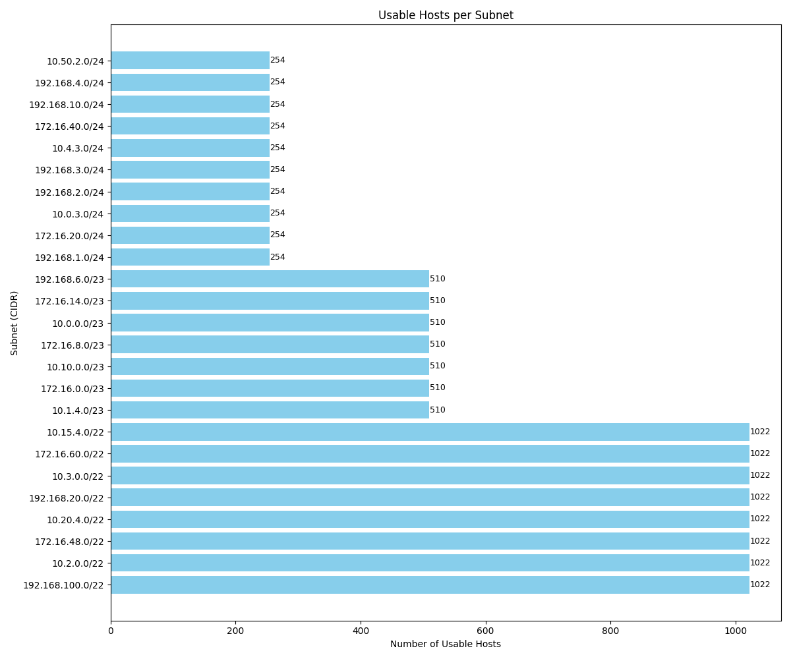

# Subnet Analysis and Visualization Tool



A Python-based tool developed for the **Barq Systems – DevOps Internship Task**, designed to analyze IP subnets, calculate network properties, and visualize subnet distributions.

---

## Project Overview

This tool demonstrates understanding of:

- IP subnetting and address calculation
- Python scripting and data processing
- Report generation (JSON/CSV)
- Basic data visualization
- Containerization using Docker

The goal is to process a dataset of IP addresses and subnet masks, generate network-level insights, and visualize subnet distributions.

---

## Objectives

The tool performs the following:

1. Reads IP data from `ip_data.xlsx`
2. Calculates for each row:
   - CIDR notation
   - Network address
   - Broadcast address
   - Number of usable hosts
3. Groups IPs by subnet/CIDR
4. Exports:
   - Summary report (`.json` and `.csv`)
   - Bar chart visualizing number of hosts per subnet
5. Containerized with Docker for portable execution
6. Answers analysis questions in `report.md`

---

## Folder Structure (Expected)

```

barq-devops-subnet-task/
├── Dockerfile
├── ip\_data.xlsx
├── subnet\_analyzer.py
├── visualize.py
├── subnet\_report.json / .csv
├── network\_plot.png
├── report.md
└── README.md

```

---

## Tech Stack

- **Language**: Python 3.9+
- **Libraries**: 
  - `pandas`
  - `ipaddress`
  - `openpyxl`
  - `matplotlib`
- **Containerization**: Docker

---

## Installation & Usage

### Local Setup

1. **Clone the repository**:
   ```bash
   git clone https://github.com/MohanedAbdelaziz/barq-devops-subnet-task.git
   cd barq-devops-subnet-task
   ```

2. **Install dependencies**:

   ```bash
   pip install pandas openpyxl matplotlib ipaddress
   ```

3. **Run analysis**:

   ```bash
   python subnet_analyzer.py
   ```

4. **Generate chart** :

   ```bash
   python visualize.py
   ```

### Docker Setup

1. **Build Docker image**:

   ```bash
   docker build -t subnet-analyzer .
   ```

2. **Run analysis inside container**:

   ```bash
   docker run -v $(pwd):/app subnet-analyzer
   ```

---

## Input Format

Provide an Excel file `ip_data.xlsx` with the following structure:

| IP Address | Subnet Mask   |
| ---------- | ------------- |
| 10.0.0.200 | 255.255.254.0 |
| 10.0.3.112 | 255.255.255.0 |

---

## Output Files

| File                     | Description                               |
| ------------------------ | ----------------------------------------- |
| `subnet_report.json`     | Summary of subnets with calculated values |
| `individual_results.csv` | Row-by-row breakdown of input analysis    |
| `network_plot.png`       | Bar chart: Hosts per subnet               |

---

## Sample Outputs

### JSON Report

```json
{
  "10.0.0.0/23": {
    "network": "10.0.0.0",
    "cidr": 23,
    "total_hosts": 512,
    "usable_hosts": 510,
    "member_ips": ["10.0.0.200"]
  }
}
```

### CSV Report

```
IP,Subnet Mask,CIDR,Network Address,Broadcast Address,Usable Hosts
10.0.0.200,255.255.254.0,23,10.0.0.0,10.0.1.255,510
```

---

## Visualization

The `visualize.py` script generates `network_plot.png`, a bar chart showing usable host count per subnet.


---

## Analysis Questions – See `report.md`

* Which subnet has the most hosts?
* Are there any overlapping subnets?
* What is the smallest and largest subnet?
* Suggest a better subnetting strategy

---

## Troubleshooting

| Issue                    | Solution                                       |
| ------------------------ | ---------------------------------------------- |
| Input file not found     | Make sure `ip_data.xlsx` is in project root    |
| Missing columns          | Excel must have "IP Address" and "Subnet Mask" |
| Docker permission errors | Try running with `sudo` or fix Docker perms    |

---


## 📬 Submission Notes

* GitHub Repo: Include all code, reports, and plots
* Required files: See folder structure above

---

**Developed for Barq Systems – DevOps Internship Application**
Author: *Mohaned Mohamed Mahmud Abdelaziz*

```

